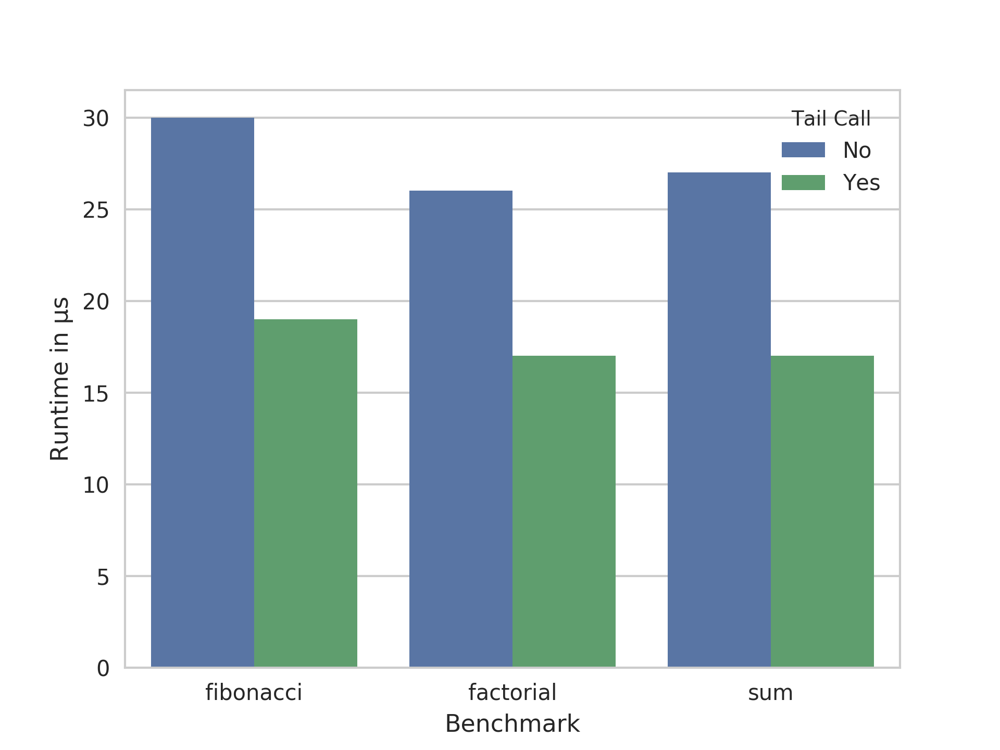
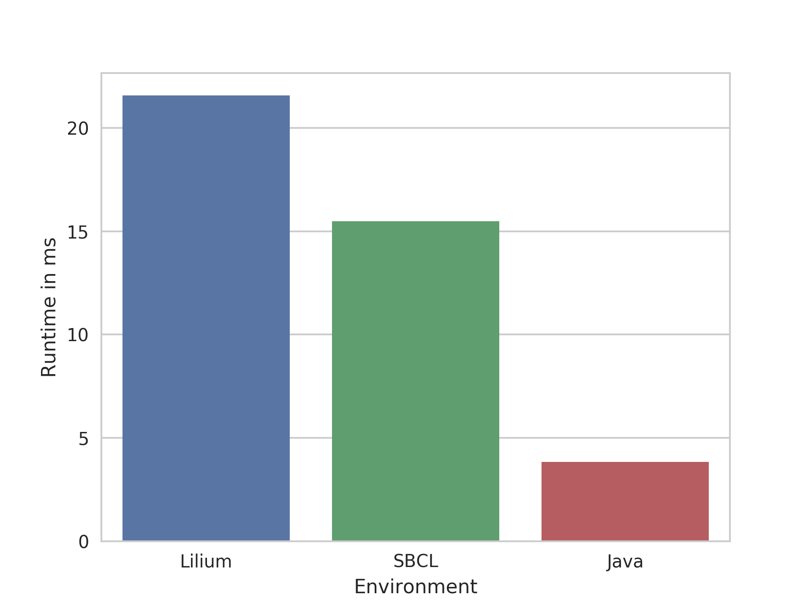

# Lilium

###  A LISP-Like Register Machine

Michael Pucher, 01425215

---

### Development History

* Starting with last years course
* First version: Flex/Bison/C++ -> limited prototype
* Second version: Boost Spirit/C++ -> C++ template hell
* Final version: Rust

---

### Architecture

* Register machine
* LISP-like language
* Translated to bytecode
* Token-threaded dispatch

---

### Architecture (cont'd)

* Only call stack
* 256 registers for each stack frame

---

### Calling conventions

* r0 has return address
* r1 has return value
* r2 etc. for arguments
* Special mov instruction for arguments

---

### Bytecode

* 4-byte instructions
* 1-byte opcode
* Usually one byte target register
* Rest for operands

---

### Bytecode Disassembly

```
0x00000: mov 4 1
0x00001: ld 5 0
0x00002: gt 3 4 5
0x00003: jtf 3 0x3
0x00004: mov 3 2
0x00005: jmf 0xd
0x00006: mov 6 1
0x00007: ld 7 1
0x00008: sub 5 6 7
0x00009: mov 7 2
0x0000a: mov 8 1
0x0000b: mul 6 7 8
0x0000c: mvo 2 5 255
0x0000d: mvo 3 6 255
0x0000e: call 0x0
0x0000f: ldr 4
0x00010: ld 5 0
0x00011: add 3 4 5
0x00012: mov 1 3
```

---

### Features

* Basic arithmetics: ```(+ 1 2), (* 1 2)```
* Basic logic: ```(& 0 1), (| 0 1), (~ 0)```
* Basic comparison: ```(== 1 1), (> 1 0)```
* Function definition: ```(def fun (a b) (+ a b))```
* Variable assignment: ```(let ((a 3)) (+ a 4))```
* Conditionals: ```(if (> a 3) (fa a) (fb b))```
* Read/print integers: ```(read), (write 123)```

---

### Implementation

* Rust (nightly)
* lalrpop as LR(1) parser generator

---

### LALRPOP Grammar

```rust
expression: Expression = {
    "(let" "(" <a:assignments> ")" <b:expressions> ")" => {
        Expression::VariableAssignment(a,b)
    },
    "(" <o:op_binary> <l:expression> <r:expression> ")" => {
        Expression::BinaryOp(o, Box::new(l), Box::new(r))
    },
    ...
};

identifier: String = {
    r"[a-zA-Z]+" => <>.to_string(),
};
```

---

### Token-Threading in Rust

* Rust performs bound checks on...
   * array access
   * *match* statements
   * basically everthing
* Can we get computed goto C performance?

---

### Unsafe And Inline Assembly

* Array access without bound check -> use **unsafe**
* Token-Threading -> use **asm**
* Comparison of dispatchers in Rust:
  https://pliniker.github.io/post/dispatchers/

---

### Token-Threading in Rust

```rust
#[cfg(target_arch = "x86_64")]
macro_rules! dispatch {
    ($vm:expr, $pc:expr, $jumptable:expr) => {
        unsafe {
            let opcode = $vm.code
                .get_unchecked($pc).opcode;
            let addr = *$jumptable
                .get_unchecked(opcode as usize);
            asm!("jmpq *$0"
                 :
                 : "r"(addr), "{rdx}"($pc)
                 :
                 : "volatile");
        }
    }
}
```

---

### Dispatch Loop

```rust
dispatch!(&thread, pc, ops);

do_and_dispatch!(&thread, ops, "op_ld", pc, {
    pc = op_ld(thread, pc);
});

do_and_dispatch!(&thread, ops, "op_ldb", pc, {
    pc = op_ldb(thread, pc);
});

do_and_dispatch!(&thread, ops, "op_ldr", pc, {
    pc = op_ldr(thread, pc);
});
```

---

### Generated Code

```asm
op_add:
	movzbl	2(%rax,%rdx,4), %edi
	addq	%rsi, %rdi
	movzbl	3(%rax,%rdx,4), %ebx
	addq	%rsi, %rbx
	movzbl	1(%rax,%rdx,4), %eax
	addq	%rsi, %rax
	movq	(%rcx,%rbx,8), %rsi
	addq	(%rcx,%rdi,8), %rsi
	movq	%rsi, (%rcx,%rax,8)
	movq	32(%r15), %rax
	movzbl	4(%rax,%rdx,4), %eax
	incq	%rdx
	movq	112(%rsp,%rax,8), %rax
	jmpq	*%rax
```

---

### Tail Call Optimization

* Stack depth is limited
* Therefore tail calls needed for loops
* Easy to implement
* Performance win!

---

### Tail Call Runtime



---

### Performance Comparison

* Fibonacci in Lilium, SBCL and Java
* Modified for SBCL (because of BigNums)
* Java version iterative (tail call equivalent)

---

### Versions

* OpenJDK 64-Bit Server VM (build 9+181, mixed mode)
* SBCL 1.4.0

---

### Fibonacci(1000000) Runtime



---

### Reasons for Bad Performance

* Register allocation very basic -> lots of moves
* OP machine code with lots of memory access
* Token-threading alone is no silver bullet
